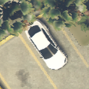

# GTAVDataCollection

GTAVDataCollection 是一个 Grand Theft Auto V 的三方模组，用于从 GTAV 中提取数据，其中包含用于机器学习训练的仿现实图片和标签


[English](./README.md) | 简体中文

## 🛠️ 环境要求

- [ScriptHookV](http://www.dev-c.com/gtav/scripthookv/)
- [ScriptHookVDotNet](https://github.com/crosire/scripthookvdotnet/releases)
- [Scripted Camera Tool](https://www.gta5-mods.com/scripts/scripted-camera-tool-1-0)
- [Visual Studio 2019](https://visualstudio.microsoft.com/vs)
- [.NET Framework ≥ 4.8](https://www.visualstudio.com/cs/downloads/)
- 其它通过 Nuget 包管理器管理的模块

## 🚀 快速开始

1. 下载并安装 ScriptHookV、ScriptHookVDotNet 和 Scripted Camera Tool
2. 下载[二进制文件](https://github.com/lsq210/GTAVDataCollection/releases/)并拷贝到 `Grand Theft Auto V/scripts/` 目录
3. 启动游戏
4. 按 T 对相机进行设置
5. 按 Y 开始或结束数据提取工作。数据将被保存到 `Grand Theft Auto V/data/` 目录

## 💿 数据集

### 下载

基于 GTAVDataCollection 构建了一个大规模遥感图像车辆目标检测的数据集：GTA5-Vehicle。请注意数据只能用来进行学术研究。

[百度网盘](https://pan.baidu.com/s/1ad8-_92C9RGL2wQpRCAjGA?pwd=8ply)

### 目标类别

数据集中包含15类车辆目标，分别是Compacts，Sedans，SUVs，Coupes，Muscle，SportsClassics，Sports，Super，OffRoad，Industrial，Utility，Vans，Service，Emergency，Commercial。以下是这些目标的示例图：
| **Compacts**|   |  |   |  |   |
|  ----  | ----  | ---- | ----  | ---- | ---- |
| **Sedans** |   |  |   |  |  |
| **SUVs** |   |  |   |  |  |
| **Coupes** |   |  |   |  |  |
| **Muscle** |   |  |   |  |  |
| **SportsClassics** |   |  |   |  |  |
| **Sports** |   |  |   |  |  |
| **Super** |   |  |   |  |  |
| **OffRoad** |   |  |   |  |  |
| **Industrial** |   |  |   |  |  |
| **Utility** |   |  |   |  |  |
| **Vans** |   |  |   |  |  |
| **Service** |   |  |   |  |  |
| **Emergency** |   |  |   |  |  |
| **Commercial** |   |  |   |  |  |
---

### 标签

每张图像对应一个标签文件，以下是一个标签的示例。第一行为图像的宽和高，第二行为相机的位姿信息，前三个X、Y、Z和后三个X、Y、Z分别代表相机在游戏世界的坐标和三个方向角。第三行起的每一行都代表一个目标，分别是目标的序号，包围盒左上角和右下角的横纵坐标，车辆类别，车辆尺寸，以及目标质量。

```text
2048,1152
X:-241.8259 Y:-2115.118 Z:150.1783,X:-89.97202 Y:-22.32331 Z:0
0,288,245,359,310,Muscle,small-vehicle,High
1,699,683,768,737,Sports,small-vehicle,High
...
```

## 引用

如果你想使用GTAVDataCollection工具或者GTA5-Vehicle数据集，请引用下面的文章：

```text

```

<p align="center">💻 <a href="https://github.com/lsq210/GTAVDataCollection" target="_blank">项目地址</a> | 📬 <a href="mailto:luoshiqi@whu.edu.cn">联系我</a></p>
