# GTAVDataCollection

[GTAVDataCollection](https://github.com/lsq210/GTAVDataCollection/) is a mod to extract synthetic data from Grand Theft Auto V.  The data includes  photo-realistic computer images and annotations that can be used for the training of machine learning algorithms.


English | [简体中文](./README-zh_CN.md)

## 🛠️ Requirements

- [ScriptHookV](http://www.dev-c.com/gtav/scripthookv/)
- [ScriptHookVDotNet](https://github.com/crosire/scripthookvdotnet/releases)
- [Scripted Camera Tool](https://www.gta5-mods.com/scripts/scripted-camera-tool-1-0)
- [Visual Studio 2019](https://visualstudio.microsoft.com/vs)
- [.NET Framework ≥ 4.8](https://www.visualstudio.com/cs/downloads/)
- Others managed by Nuget

## 🚀 Quick Start

1. Download and install ScriptHookV、ScriptHookVDotNet and Scripted Camera Tool.
2. Download [pre-built binaries](https://github.com/lsq210/GTAVDataCollection/releases/) and copy them to `Grand Theft Auto V/scripts/`.
3. Start the game.
4. Press T to set the camera.
5. Press Y to start or stop extracting data. The data should be created in `Grand Theft Auto V/data/`.

## 💿 Dataset

### Download

A large-scale remote sensing image dataset for vehicle object detection called GTA5-Vehicle has been built based on GTAVDataCollection.
Please also note that the data is for research and educational use only.

[Baidu Netdisk](https://pan.baidu.com/s/1ad8-_92C9RGL2wQpRCAjGA?pwd=8ply)

### Object Category

The dataset includes 15 vehicle object classes: Compacts, Sedans, SUVs, Coupes, Muscle, SportsClassics, Sports, Super, OffRoad, Industrial, Utility, Vans, Service, Emergency, and Commercial. Here are some example images of these objects:

<table>
  <tr>
    <td><b>Compacts</b></td>
    <td>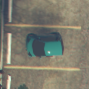</td>
    <td></td>
    <td></td>
    <td>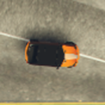</td>
    <td></td>
  </tr>
  <tr>
    <td><b>Sedans</b></td>
    <td></td>
    <td></td>
    <td></td>
    <td>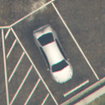</td>
    <td></td>
  </tr>
  <tr>
    <td><b>SUVs</b></td>
    <td></td>
    <td></td>
    <td></td>
    <td></td>
    <td>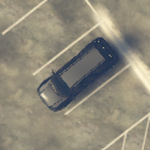</td>
  </tr>
  <tr>
    <td><b>Coupes</b></td>
    <td></td>
    <td></td>
    <td></td>
    <td>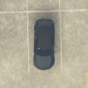</td>
    <td></td>
  </tr>
  <tr>
    <td><b>Muscle</b></td>
    <td>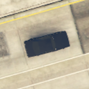</td>
    <td></td>
    <td></td>
    <td>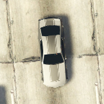</td>
    <td></td>
  </tr>
  <tr>
    <td><b>SportsClassics</b></td>
    <td></td>
    <td>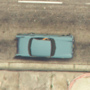</td>
    <td></td>
    <td></td>
    <td></td>
  </tr>
  <tr>
    <td><b>Sports</b></td>
    <td></td>
    <td></td>
    <td></td>
    <td></td>
    <td>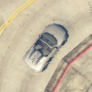</td>
  </tr>
  <tr>
    <td><b>Super</b></td>
    <td></td>
    <td></td>
    <td></td>
    <td></td>
    <td></td>
  </tr>
  <tr>
    <td><b>OffRoad</b></td>
    <td>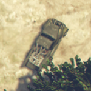</td>
    <td>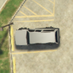</td>
    <td>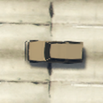</td>
    <td></td>
    <td></td>
  </tr>
  <tr>
    <td><b>Industrial</b></td>
    <td></td>
    <td></td>
    <td>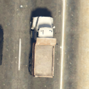</td>
    <td></td>
    <td></td>
  </tr>
  <tr>
    <td><b>Utility</b></td>
    <td></td>
    <td>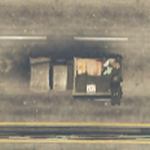</td>
    <td></td>
    <td>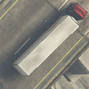</td>
    <td>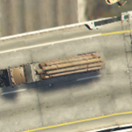</td>
  </tr>
  <tr>
    <td><b>Vans</b></td>
    <td></td>
    <td>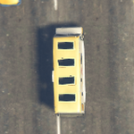</td>
    <td></td>
    <td></td>
    <td>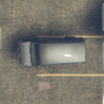</td>
  </tr>
  <tr>
    <td><b>Service</b></td>
    <td></td>
    <td></td>
    <td></td>
    <td></td>
    <td></td>
  </tr>
  <tr>
    <td><b>Emergency</b></td>
    <td>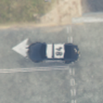</td>
    <td></td>
    <td></td>
    <td></td>
    <td></td>
  </tr>
  <tr>
    <td><b>Commercial</b></td>
    <td>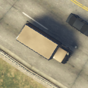</td>
    <td>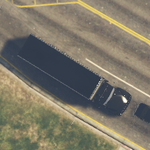</td>
    <td></td>
    <td>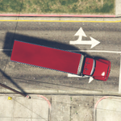</td>
    <td></td>
  </tr>
</table>


### Label Format

Each image has a corresponding label file. Here’s an example of a label structure: The first line contains the image’s dimensions. The second line provides camera pose information, including position and orientation. From the third line onwards, each line represents a target with its index, bounding box coordinates, vehicle category, size, and quality

```text
2048,1152
X:-420.2515 Y:-2069.219 Z:144.7112,X:-89.97202 Y:-70.18397 Z:0
0,1120,255,1149,331,Sedans,small-vehicle,High
1,1100,732,1126,796,Sedans,small-vehicle,High
2,3,701,92,801,Commercial,large-vehicle,High
...
```

## Citation

If you make use of the GTAVDataCollection or GTA5-Vehicle dataset, please cite our following paper

```text

```

<p align="center">💻 <a href="https://github.com/lsq210/GTAVDataCollection" target="_blank">项目地址</a> | 📬 <a href="mailto:luoshiqi@whu.edu.cn">联系我</a></p>
